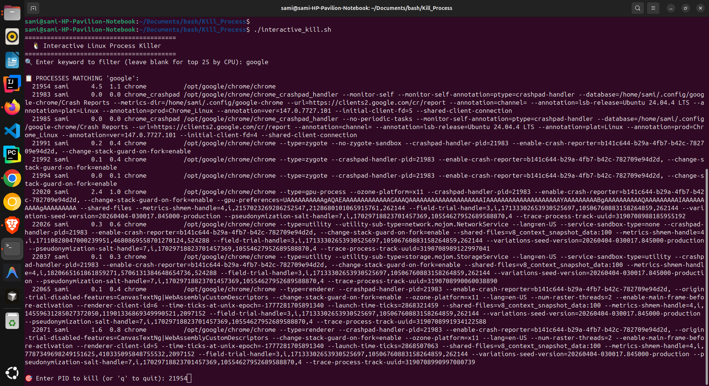
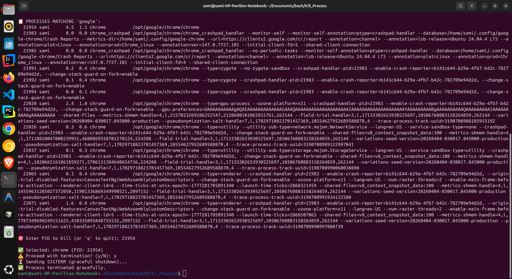

# 🖥️ Interactive Process Killer
A lightweight, interactive Bash script to safely find and terminate Linux processes. Instead of guessing PIDs or using blind pkill commands, this tool displays running processes, lets you filter them, confirms your selection, and applies a graceful shutdown before falling back to force termination.

---

## Features

🔍 Smart Search – Filter processes by keyword (case-insensitive) or view top CPU consumers  
🛡️ Built-in Safety – Blocks PID 1, validates input, and checks permissions before acting  
✅ Confirmation Step – Shows process name + PID and requires explicit y/N approval  
🕊️ Graceful Shutdown – Sends SIGTERM first, waits 5s, then falls back to SIGKILL only if needed  
📊 Clean, Readable Output – Displays PID, user, CPU%, memory%, command, and full arguments  
🎯 Zero-Config & Interactive – No flags or complex syntax; just run and follow the prompts  
🔐 Permission-Aware – Clearly reports access issues and suggests sudo when required

---

## Project Structure

```
Kill_Process/
├── interactive_kill.sh
├── README.md
└── docs
    └── screenshots
        └── output1.png
        └── output2.png
```

---

## Installation & Usage

1. Clone or download the repository

```
git clone https://github.com/Osama-2024-Ahmad/kill_process.git
cd kill_process
```
2. Make the script executable
```
chmod +x interactive_kill.sh
```
3. Run the script
```
# View top CPU-consuming processes
./interactive_kill.sh

# Search for processes by keyword for example
.nginx
.python
.java
.firefox
# Enter PID to kill (or 'q' to quit): 
# Proceed with termination? (y/N): y

```
---

## Screenshots



## License

MIT
